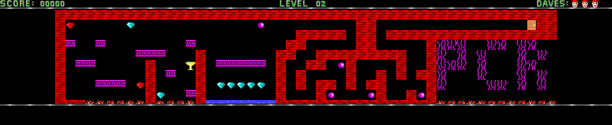
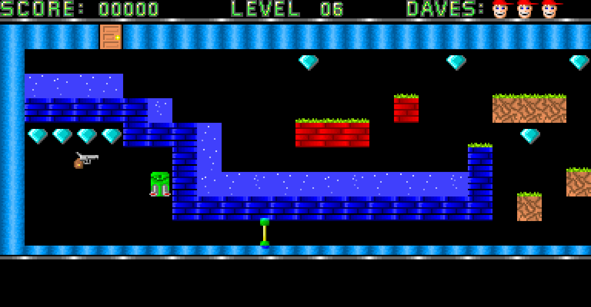

# Deadly Dave

An open source reimplementation of *Dangerous Dave* (John Romero, 1988) that
runs natively on Windows, macOS and Linux: the same sprites, levels, sounds and
feel, with no emulator and nothing to install.

> **Disclaimer:** the improvements in this fork were made possible by AI coding
> agents, Claude Code and OpenCode (running DeepSeek models). Read the diff with
> that in mind.

## Features

- **The whole game:** all ten levels, the four warp zones, the intro, the ending,
  the high score table and the original sound effects.
- **Self-contained downloads** for Windows, macOS and Linux, with SDL3 built in.
- **Any screen:** a wider screen shows more of the level instead of stretching
  it. Scaling is pixel perfect, fit to screen, or a fixed 1x/2x/3x.
- **Smooth scrolling:** the view can follow Dave pixel by pixel, or slide a
  screen at a time with the game paused, as the original does.
- **Steam Deck ready:** 1280x800 is exactly 4x the original, and the built-in
  controls work as a gamepad.
- **Keyboard and controller**, both at once, and a pad can be plugged in while
  playing.
- **VGA, EGA or CGA:** the original's EGA and CGA artwork is there too, one
  menu row away.
- **CRT filters:** scanlines, the Blargg NTSC composite filter, or both. In CGA
  mode NTSC is the CGA's own composite output, artifact colours included,
  from reenigne's measurements of a real card.
- **Assists:** no enemies, infinite lives or god mode, for a half, a third or a
  quarter of the points.
- **Pause menu** (`Escape` / `Start`) with V-sync, FPS limit, window mode,
  scaling, video mode, filters, scrolling, assists and a level warp. Settings are remembered between
  runs, except assists and the warp.

## Controls

| Action     | Keyboard                   | Controller               |
| ---------- | -------------------------- | ------------------------ |
| Move       | `A` / `D`, or arrows       | left stick or D-pad      |
| Jump       | `W`, or up                 | `A`                      |
| Climb      | `W` / `S`, or up / down    | stick or D-pad up / down |
| Shoot      | `Space`, or left Ctrl      | `X`, or right shoulder   |
| Jetpack    | `J`                        | `B`                      |
| Pause menu | `Escape`                   | `Start`                  |

`F5` cycles the scaling, and `Cmd`+`Enter` (macOS) or `Alt`+`Enter` toggles full
screen. `-w` starts windowed and `-l <level>` starts on a given level.

## High scores

As in the original, a run that ends on a score beating one of the five rows
asks for a name of up to three characters. Type it and press `Enter`, or, on a
controller, pick each character with the D-pad up / down and take it with `A`
(`B` erases, `Start` keeps the name). A score made with an assist is marked
with a star.

The table and the settings are kept in `highscores.ini` and `config.ini`, in
`~/Library/Application Support/vittau/deadly-dave/` on macOS,
`%APPDATA%\vittau\deadly-dave\` on Windows and
`~/.local/share/vittau/deadly-dave/` on Linux. Deleting a file brings back its
defaults.

## Getting it

Download your system's package from the
[releases page](https://github.com/vittau/deadly-dave/releases):

- **Windows:** `deadly-dave-windows-x86_64.zip`, run `deadly-dave.exe`.
- **macOS:** `deadly-dave-macos-universal.zip`, drag `Deadly Dave.app` to
  Applications. The app is not notarized, so clear the quarantine flag once
  before opening it:

      xattr -dr com.apple.quarantine "/Applications/Deadly Dave.app"

- **Linux:** `deadly-dave-linux-x86_64.tar.gz`, run `./deadly-dave`.

## Building it

Needs **SDL 3.4.16** or newer and a C99 compiler.

    make                 # uses pkg-config to find SDL3
    make app             # macOS: builds "Deadly Dave.app"
    cd tests && make     # unit tests

The CMake build fetches and links SDL3 statically, as the releases do. Pushing a
`v*` tag builds and publishes the three packages.

## Acknowledgments

* skoperst    - for [deadly-dave](https://github.com/skoperst/deadly-dave), the
                port this one is forked from.
* MaiZure     - for starting the 'lmdave' project this is based on.
* Malvineous  - for allowing the unpacking of original resources from dave.exe.
